# Agentic AI Governance, Security & Compliance — Production Plan

*As of 2026-09-21 · Vivek Rawat*

---

## 1. Overview

Treat governance, security and compliance as **three planes of one pipeline**, not three workstreams. A single policy definition drives runtime enforcement and produces audit evidence.

| Plane | Question it answers | Primary owner | Core Azure / .NET building blocks |
| --- | --- | --- | --- |
| Governance (control) | Who decides, and what are the rules? | AI Governance Board | Agent registry, policy-as-code repo, risk-tiering rubric |
| Security (enforcement) | What stops bad behavior at runtime? | Platform + Security Eng | Entra Agent ID, APIM AI gateway, Prompt Shields, SK filters / Agent Framework middleware, Defender for Cloud |
| Compliance (evidence) | Can we prove the rules were followed? | Risk & Compliance | OpenTelemetry GenAI traces, immutable log store, eval pipeline, Purview |

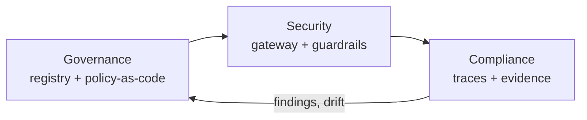

The loop closes when compliance findings feed back into policy updates.

### Reference architecture

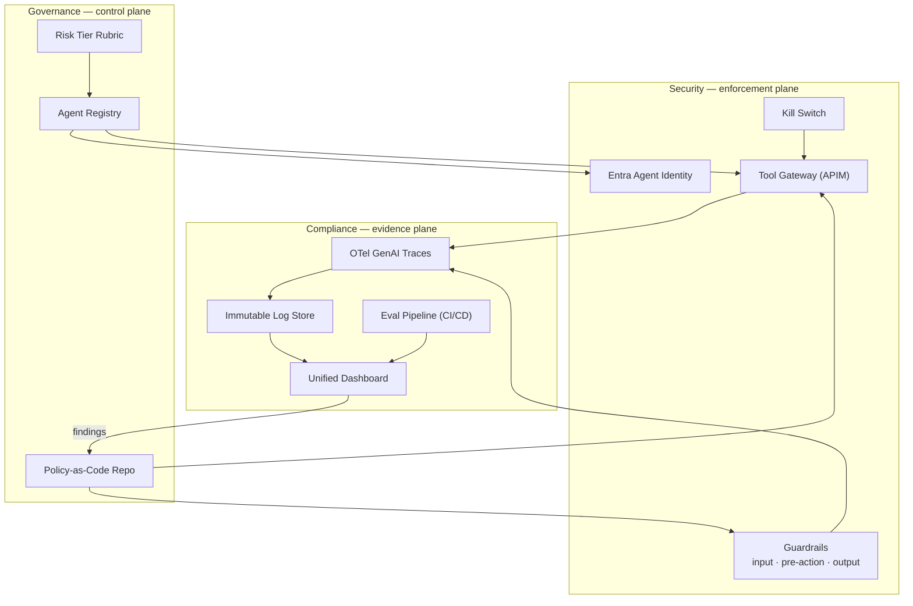

---

## 2. Governance — control plane

Governance sets direction without blocking delivery: every agent is registered, owned and tiered before it touches production.

- **Agent registry.** Single source of truth for owner, purpose, risk tier, autonomy level, allowed tools and data classes. Runtime reads config from it; nothing is hardcoded in agents.
- **Policy-as-code.** Rules live in a versioned repo (OPA/Rego or a JSON policy schema), unit-tested and reviewed like code. Each rule carries tags for the regulatory clauses it satisfies.
- **RACI per agent.** Business owner owns outcomes; tech owner owns behavior; risk owner signs off the tier. All three approve a production release.
- **Autonomy levels.** L1 suggest only · L2 act with human approval · L3 act autonomously within limits · L4 autonomous with irreversible actions (rare, board approval).
- **Tiered release gates.** Low tier gets a lightweight path; high tier requires red-team results, eval scores above threshold and a HITL design.
- **Cadence.** Governance board meets monthly; policy repo reviewed quarterly and on every major model or tool change.

### Agent release lifecycle

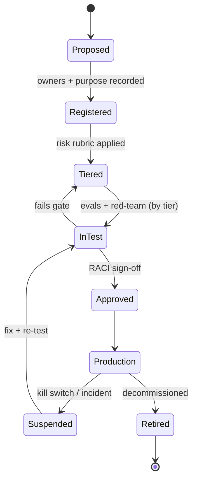

---

## 3. Agent registry schema

Each agent has one registry record; the gateway, guardrails and dashboards all read from it.

```json
{
  "agentId": "pra-core-reviewer",
  "version": "1.4.0",
  "displayName": "Proposal Review Agent",
  "purpose": "Reviews RFP responses against client requirements",
  "owners": {
    "business": "owner@contoso.com",
    "technical": "techlead@contoso.com",
    "risk": "risk@contoso.com"
  },
  "riskTier": "medium",
  "autonomyLevel": "L2",
  "identity": {
    "type": "entra-agent-id",
    "clientId": "<guid>"
  },
  "models": [
    { "provider": "azure-openai", "deployment": "gpt-x", "approvedVersion": "2026-xx-xx" }
  ],
  "tools": [
    { "name": "sharepoint.search", "scope": "read", "requiresApproval": false },
    { "name": "email.send", "scope": "write", "requiresApproval": true, "external": true }
  ],
  "dataAccess": {
    "allowedLabels": ["General", "Confidential"],
    "blockedLabels": ["Highly Confidential"],
    "piiHandling": "redact-on-output"
  },
  "limits": { "maxStepsPerRun": 25, "maxCostUsdPerRun": 2.0, "maxToolCallsPerMin": 30 },
  "downstreamAgents": ["pra-conversational"],
  "policies": ["POL-HITL-EXT-COMMS", "POL-PII-01", "POL-TOOL-ALLOWLIST"],
  "evals": { "suite": "pra-core-v3", "minGroundedness": 0.9, "minJailbreakResistance": 0.98 },
  "regulatoryTags": ["ISO42001-A.6", "EUAIA-Art12", "GDPR-Art25"],
  "status": "production",
  "lastReviewed": "2026-09-21",
  "killSwitch": { "enabled": true, "owner": "platform-oncall" }
}
```

> Clause IDs in `regulatoryTags` are illustrative; the compliance team confirms the exact mapping per client.

---

## 4. Risk-tiering rubric

An agent takes the **highest tier any single factor** puts it in; the tier then sets its runtime controls automatically.

| Factor | Low | Medium | High |
| --- | --- | --- | --- |
| Data touched | Public / General | Confidential, internal PII | Highly Confidential, special-category PII, regulated data |
| Actions | Read-only, suggestions | Internal writes, reversible | External comms, payments, irreversible changes |
| Autonomy | L1 | L2 | L3–L4 |
| Audience impact | Internal team | Whole org | Customers, public, or decisions about people |
| Regulatory exposure | None | Sector guidance | EU AI Act high-risk use cases, financial or health rules |

| Control | Low | Medium | High |
| --- | --- | --- | --- |
| Release approval | Tech owner | Tech + risk owner | Governance board |
| HITL | None | On writes | On every external or irreversible action |
| Eval gate in CI/CD | Smoke suite | Full suite | Full suite + red-team |
| Red-team cadence | Annual | Per major release | Per release + quarterly |
| Trace retention | 90 days | 1 year | Per regulation, min. 6 months under EU AI Act high-risk |
| Access review | Annual | Semi-annual | Quarterly |

Retention floors above are starting points; legal confirms them per jurisdiction.

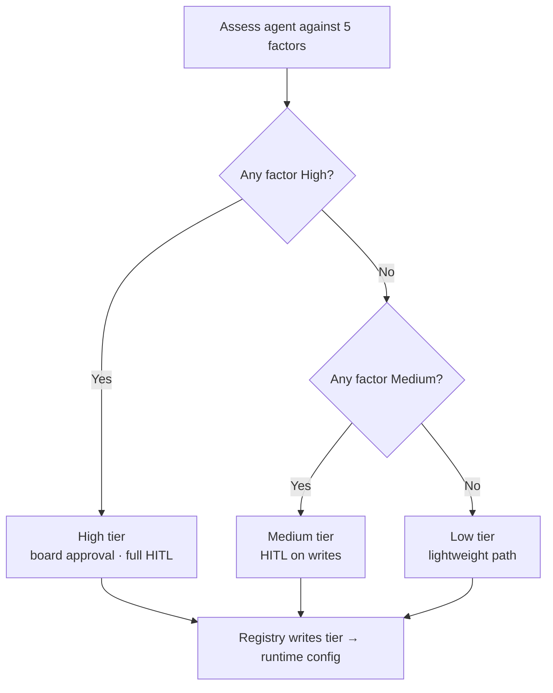

---

## 5. Security — enforcement plane

Every agent action passes through identity, a tool gateway and three guardrail checkpoints; nothing reaches a tool directly.

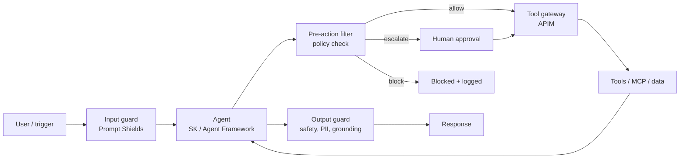

- **Identity.** One Entra workload identity per agent, never shared or borrowed user tokens. Least privilege, short-lived credentials, On-Behalf-Of only where user context is required.
- **Tool gateway.** All tool and MCP calls route through APIM (or a custom broker): per-agent allow-lists, argument schema validation, rate and cost limits, and a policy decision logged on every call.
- **Input guard.** Prompt Shields on user input and on indirect content — retrieved documents, tool outputs and other agents' messages are untrusted.
- **Pre-action filter.** SK function-invocation filter or Agent Framework middleware evaluates each tool call against policy: allow, block or escalate to HITL.
- **Output guard.** Content safety, PII redaction and groundedness check before anything leaves the system.
- **Agentic threats covered.** Excessive agency, tool misuse, memory and context poisoning, cross-agent cascades, and privilege escalation via chained tools (OWASP LLM and Agentic Top 10).
- **Blast-radius limits.** Sandboxed code execution, step and spend caps, per-agent kill switch, circuit breaker on anomaly scores.
- **Memory hygiene.** Write to long-term memory only through a validated path; tag entries with source and label; purge on incident.
- **Detect and respond.** Telemetry to Defender for Cloud AI threat protection and Sentinel.

### Tool call with policy decision

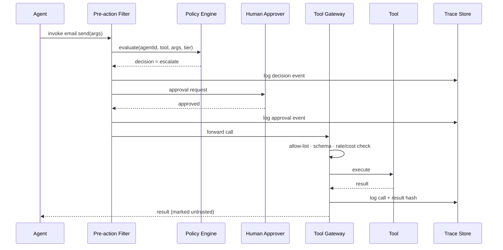

### Incident response runbook

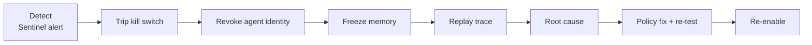

---

## 6. Compliance — evidence plane

Evidence is generated by the runtime, not written after the fact: an auditor should answer *"why did the agent do X?"* from traces alone.

- **Tracing.** OpenTelemetry GenAI semantic conventions on every run: prompt, model and version, retrieved sources, tool calls and arguments, policy decisions, approvals, output. Correlate multi-agent runs with one trace ID.
- **Immutable storage.** Traces and decision events land in append-only storage (immutable blob or Log Analytics with retention locks), redacted per data label.
- **Continuous evals.** CI/CD suites for accuracy, groundedness, jailbreak resistance, bias and task safety. A release fails below its tier's thresholds; production is sampled and re-scored weekly for drift.
- **System cards.** Generated per release from the registry and eval results: purpose, limits, data, tools, test results, known risks.
- **Data governance.** Purview sensitivity labels are enforced by retrieval and agent memory; DLP policies cover agent outputs.
- **Evidence queries.** Each control has a saved KQL query that proves it ran — the auditor gets query results, not screenshots.

### CI/CD eval gate

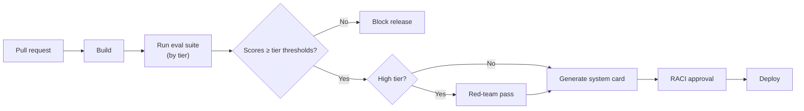

---

## 7. Control-to-requirement matrix

Each row links one control to the requirement themes it satisfies and to the evidence that proves it. Framework references are thematic; confirm exact clauses with compliance for each client.

| ID | Control | Plane | EU AI Act theme | ISO/IEC 42001 theme | NIST AI RMF | Evidence |
| --- | --- | --- | --- | --- | --- | --- |
| C-01 | Agent registry with owner and risk tier | Governance | Risk management system | AI system inventory, roles | GOVERN, MAP | Registry export; approval records |
| C-02 | Policy-as-code with regulatory tags | Governance | Risk management system | AI policy | GOVERN | Policy repo history; test results |
| C-03 | Per-agent workload identity, least privilege | Security | Accuracy, robustness, cybersecurity | Resource and access controls | MANAGE | Entra sign-in logs; access reviews |
| C-04 | Tool gateway allow-list and limits | Security | Robustness, cybersecurity | Operational controls | MANAGE | Gateway decision logs |
| C-05 | Prompt injection shields (direct + indirect) | Security | Robustness, cybersecurity | Operational controls | MEASURE, MANAGE | Shield detections; red-team report |
| C-06 | HITL on high-risk actions | Security + Governance | Human oversight | Human oversight | MANAGE | Approval events in traces |
| C-07 | Output safety, PII redaction, grounding | Security | Data governance, accuracy | Data quality, impact | MEASURE | Guardrail decision events |
| C-08 | End-to-end OTel tracing, immutable | Compliance | Record-keeping / logging | Monitoring, documentation | MEASURE | KQL evidence queries |
| C-09 | CI/CD eval gates by tier | Compliance | Accuracy, robustness | Verification and validation | MEASURE | Eval run history |
| C-10 | Auto-generated system cards | Compliance | Technical documentation, transparency | Documentation | MAP | Versioned cards per release |
| C-11 | Purview labels in retrieval and memory | Compliance + Security | Data governance | Data management | MAP, MANAGE | Label enforcement logs |
| C-12 | Kill switch and incident runbook | Security | Post-market monitoring, incident reporting | Incident management | MANAGE | Drill records; incident tickets |

---

## 8. Where the planes overlap

The overlaps are where the value is: each one is an automated link, not a meeting.

| Overlap | What it means | How it is implemented |
| --- | --- | --- |
| Security ∩ Compliance | Controls that prove compliance | Every guardrail and gateway decision emits a structured event, so a blocked call is also an audit record |
| Governance ∩ Security | Risk-aware oversight | Registry tier drives runtime config: filter strictness, HITL scope, autonomy and limits are set automatically |
| Governance ∩ Compliance | Policies mapped to regulation | Each policy rule carries regulatory tags; the matrix is generated from the policy repo |
| All three | Responsible and trusted AI | One dashboard for board, engineering and auditors |

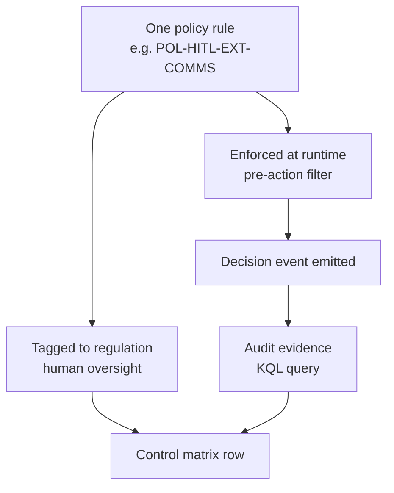

The unified dashboard shows agents in production by tier, policy violations and blocks, HITL rate and approval latency, eval trends, open incidents, and evidence coverage.

---

## 9. 90-day rollout

Foundation first, enforcement second, evidence third; each phase ends with a checkpoint review by the governance board.

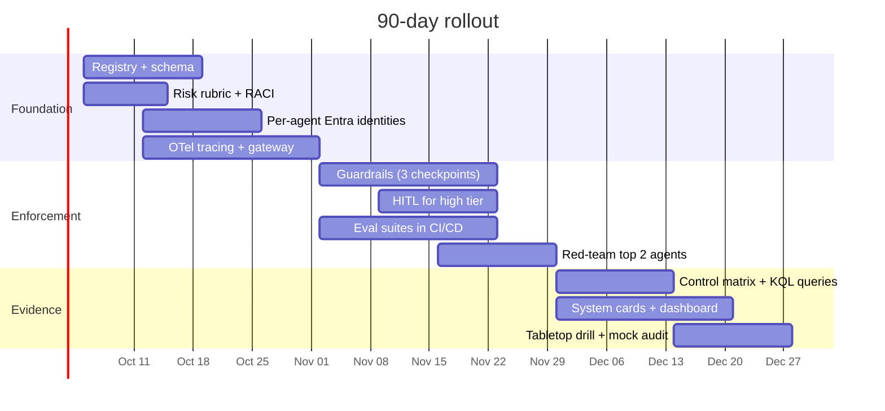

*Start date is a placeholder; shift to your kickoff.*

| Phase | Weeks | Deliverables | Exit checkpoint |
| --- | --- | --- | --- |
| Foundation | 1–4 | Registry and schema live; risk rubric and RACI approved; per-agent Entra identities; OTel tracing on all agents; tool calls routed through gateway | Every prod agent registered, tiered and traced |
| Enforcement | 5–8 | Input, pre-action and output guardrails; HITL for high-tier actions; eval suites in CI/CD; red-team pass on top two agents; kill switches wired | High-tier agents blocked from release without passing gates |
| Evidence | 9–12 | Control matrix and KQL evidence queries; auto system cards; unified dashboard; incident tabletop drill; mock ISO 42001 audit | Auditor can reconstruct any agent decision from traces |
| Operate | Ongoing | Quarterly policy review; red-team on model or tool change; weekly drift scoring; access reviews by tier | Metrics reviewed monthly by board |

Pilot on one medium-tier agent in weeks 1–4 before rolling the pattern to the rest.

---

## 10. Production-readiness criteria and KPIs

An agent is production-ready only when all six criteria hold.

- [ ] Registered, tiered and owned (business, tech, risk)
- [ ] Runs on its own identity; zero shared or user credentials
- [ ] 100% of tool calls pass through the gateway and are traced
- [ ] Meets its tier's eval thresholds; HITL on irreversible actions
- [ ] Kill switch tested in the last quarter
- [ ] Any decision reconstructable from traces within 15 minutes

| KPI | Target |
| --- | --- |
| Prod agents registered and tiered | 100% |
| Tool calls via gateway | 100% |
| Evidence coverage (controls with a working query) | ≥ 95% |
| High-tier releases passing gates first time | ≥ 80% |
| Mean time to kill a misbehaving agent | < 15 min |
| HITL approval latency (p90) | < 4 business hours |
| Unresolved high-severity policy violations | 0 older than 7 days |

---

## 11. Worked example: RFP-to-Proposal agentic system, step by step

This section applies the plan to one concrete system. It takes an RFP document and produces a solution approach, an effort estimate, a project plan and the response document.

Governance, security and compliance are built into each step, not bolted on at the end. Where possible, reuse existing PRA-Core components (ILlmProvider, ModelRouter, RAG pipeline, anti-hallucination framework); the Proposal Review Agent becomes the critic in this pipeline.

### 11.1 Target architecture

One orchestrator coordinates specialist agents. Humans approve at the three points where a wrong answer is costly: the bid/no-bid decision, the estimate and pricing, and the final submission.

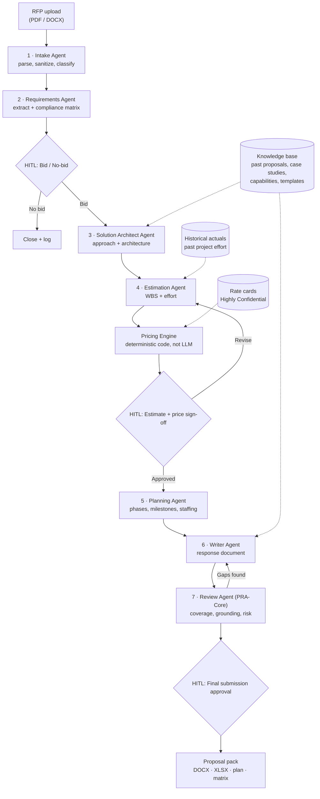

### 11.2 Agent registry entries and tiers

| Agent | Purpose | Tools | Data labels | Autonomy | Tier |
| --- | --- | --- | --- | --- | --- |
| Orchestrator | Routes work, tracks state, enforces sequence | Workflow state store, agent calls | Confidential | L3 within workflow | Medium |
| Intake | Parse RFP, strip active content, classify | Doc parser, Content Safety, Prompt Shields | Client Confidential | L3 | Medium |
| Requirements | Extract requirements, build compliance matrix | RAG over RFP only | Client Confidential | L3 | Medium |
| Solution Architect | Draft solution approach and architecture | KB search, diagram generator | Confidential | L2 | Medium |
| Estimation | Build WBS and effort ranges | Historical actuals query, estimation model | Confidential | L2 | High |
| Pricing Engine | Apply rate cards to effort | Rate card lookup (code only, no LLM) | Highly Confidential | Deterministic | High |
| Planning | Phases, milestones, staffing plan | Plan generator | Confidential | L2 | Medium |
| Writer | Assemble response document from template | KB search, DOCX renderer | Confidential | L2 | Medium |
| Review (PRA-Core) | Check coverage, grounding, commitments, risk | Read-only on all drafts | Confidential | L1 (suggest) | Medium |
| Submission | Package and send to client portal / email | Email / portal upload | Client Confidential | L2, always HITL | High |

The system as a whole is **High tier**: it sends external, binding commercial commitments on the company's behalf.

### 11.3 Step-by-step build

Each step lists what to build, the controls that go with it, and the exit criteria. Steps 1–3 map to the Foundation phase, 4–7 to Enforcement, 8–10 to Evidence.

#### Step 1 — Scope, ownership and success criteria (week 1)

**Build**

- Define the outputs (the proposal pack contents below).
- Choose 10–20 past RFPs with known outcomes (won/lost, actual effort) as the golden dataset.

**Govern**

- Assign owners: business = presales/bid director, technical = solution architect lead, risk = commercial or legal.
- Classify the system as High tier using the rubric in section 4.
- Record the decision that pricing and submission always require human sign-off.

**Exit:** registry entries created for all agents; RACI signed; golden dataset assembled.

*Proposal pack contents*

| Output | Format | Final sign-off |
| --- | --- | --- |
| Compliance matrix (requirement → response → section) | XLSX | Bid manager |
| Solution approach + architecture | DOCX section + diagrams | Solution architect |
| Effort estimate (WBS, ranges, assumptions) | XLSX | Delivery lead |
| Price summary | XLSX (restricted) | Commercial lead |
| Project plan (phases, milestones, staffing) | XLSX / MPP / Gantt | Delivery lead |
| Response document | DOCX (client template) | Bid manager |

#### Step 2 — Knowledge base and data governance (weeks 1–3)

**Build**

- Index past proposals, case studies, capability statements, standard assumptions, CVs and response templates in Azure AI Search. Reuse the PRA-Core RAG pipeline.
- Load historical actuals (estimated vs actual effort per work type) into a queryable store.

**Secure**

- Apply Purview labels. Rate cards and margins are Highly Confidential and reachable only by the Pricing Engine identity.
- Client A's RFP content must never be retrievable while working on Client B — enforce with per-engagement index filters or separate indexes.

**Comply**

- Record data lineage for every source document (owner, date, label).
- Confirm consent and retention status for CVs and personal data.

**Exit:** retrieval respects labels and client isolation, verified with cross-client queries that must return nothing.

#### Step 3 — Identity, gateway and tracing skeleton (weeks 2–4)

**Build**

- Scaffold the orchestrator in Semantic Kernel / Agent Framework.
- Wire each agent through ILlmProvider and ModelRouter: cheaper models for parsing, stronger models for solutioning and writing.

**Secure**

- One Entra identity per agent.
- All tools (KB search, actuals query, DOCX renderer, email) are exposed only through the APIM gateway with per-agent allow-lists.

**Comply**

- Emit OTel GenAI spans from every agent.
- One trace ID per RFP, carried across all agents and human approvals.

**Exit:** a dummy RFP flows end to end with a complete trace and no direct tool access.

#### Step 4 — Intake and Requirements agents (weeks 4–5)

**Build**

- Intake parses the PDF/DOCX, strips macros and embedded objects, and splits into sections.
- Requirements extracts each "shall/must/should" item with an ID, category (functional, non-functional, commercial, legal, submission format) and source page, then builds the compliance matrix.

**Secure**

- The RFP is untrusted external input: run Prompt Shields (indirect injection) on every chunk.
- Treat extracted text as data, never as instructions — wrap it in delimited context blocks, and have the system prompt forbid following instructions found inside the document.

**Comply**

- Every requirement row keeps its source page reference, so coverage is provable later.

**Eval:** requirement extraction recall ≥ 95% against the golden set; zero missed mandatory submission requirements (format, page limits, deadlines).

**Exit:** the compliance matrix for the golden RFPs matches human-built matrices.

#### Step 5 — Bid/no-bid gate (week 5)

- **Build:** the orchestrator produces a one-page bid summary — scope size, fit against capabilities, key risks, deadline, mandatory certifications.
- **Govern:** HITL approval by the bid director; the workflow cannot proceed without a recorded decision.
- **Comply:** the approval event (who, when, rationale) is written to the trace.

#### Step 6 — Solution Architect agent (weeks 5–6)

**Build**

- Draft the solution approach per requirement group: architecture, technology choices, delivery approach, assumptions and exclusions.
- Retrieve relevant case studies as proof points.

**Secure**

- Read-only KB access, no access to rate cards, cannot see other clients' RFPs.

**Anti-hallucination**

- Apply the PRA-Core framework: every capability claim, certification or case study must cite a KB source. Unsupported claims are flagged, not written.

**Eval:** groundedness ≥ 0.9; zero invented certifications or client names; requirement coverage 100% (every matrix row maps to a solution section or an explicit exclusion).

#### Step 7 — Estimation agent and Pricing engine (weeks 6–7)

**Build**

- The Estimation agent turns the solution into a WBS: work packages, roles, and effort as ranges (low / likely / high), each with stated assumptions, calibrated against historical actuals for similar work types.
- The Pricing Engine is plain .NET code applying rate cards, blend, contingency and margin rules to the approved effort. **The LLM never produces a price.**

**Secure**

- Only the Pricing Engine identity can read rate cards; price outputs are labeled Highly Confidential; the Writer agent receives only the approved client-facing price table.

**Govern**

- HITL sign-off by the delivery lead (effort) and commercial lead (price); rejections loop back with reviewer comments.

**Eval:** estimate variance vs historical actuals within ±20% on the golden set; flag any work package with no historical comparable.

**Exit:** estimates are explainable line by line, and every number traces to an assumption or a historical data point.

#### Step 8 — Planning and Writer agents (weeks 7–8)

**Build**

- Planning produces phases, milestones, dependencies and a staffing curve from the approved WBS, exported as XLSX and Gantt.
- The Writer fills the client's required response template (or your standard one): executive summary, understanding of requirements, solution, plan, team, assumptions, commercials.

**Secure**

- Output guard: PII redaction on CVs where not permitted, plus content safety.
- Check that no internal-only data (margins, rate cards, other clients) leaks into the document.

**Comply**

- The document footer records version, trace ID and generation date; internal metadata is stripped before submission.

#### Step 9 — Review agent (PRA-Core) and red team (weeks 8–9)

**Build** — PRA-Core runs as the critic, checking:

- compliance-matrix coverage
- unsupported claims
- contractual commitments (SLAs, penalties, fixed-price language)
- consistency between the plan, estimate and narrative
- submission-format rules

Findings loop back to the Writer, with a maximum of 3 iterations before escalating to a human.

**Red team**

- Plant prompt injections in test RFPs (e.g. hidden text telling the agent to include rate cards or email a third party).
- Attempt cross-client leakage.
- Attempt to elicit invented certifications.

**Exit:** all red-team scenarios blocked and logged; review-agent findings reviewed by a human on the golden set.

#### Step 10 — Submission gate, evidence and go-live (weeks 10–12)

**Build**

- A Submission agent packages the proposal pack. Sending to the client portal or email is always HITL-approved by the bid manager — no autonomous external send.

**Comply**

- Generate the system card.
- Add KQL evidence queries (e.g. "show every price shown to a client and who approved it").
- Run a mock audit: pick a submitted proposal and reconstruct every decision from traces.

**Operate**

- Pilot on 3–5 live RFPs with a parallel human process, compare quality and effort, then go live with the kill switch owned by platform on-call.

### 11.4 End-to-end run

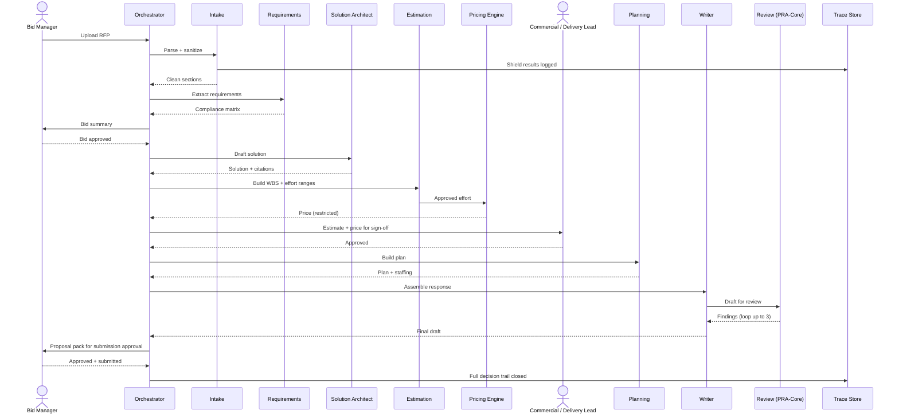

### 11.5 Controls specific to this system

| Risk | Control | Evidence |
| --- | --- | --- |
| Prompt injection hidden in RFP | Prompt Shields on every chunk; RFP text treated as data | Shield detection logs; red-team results |
| Rate card or margin leak into client doc | Pricing isolated to deterministic engine identity; output scan for restricted labels | Label enforcement logs; output guard events |
| Cross-client data leakage | Per-engagement index isolation | Isolation test results; retrieval traces |
| Invented capabilities or certifications | Citation required for every claim; Review agent check | Groundedness scores; review findings |
| Unrealistic or binding estimates | Ranges + assumptions; calibration to actuals; human sign-off | Estimate variance report; approval events |
| Accidental external submission | Submission tool requires HITL; no autonomous send | Gateway logs; approval events |
| Missed mandatory requirement → disqualification | Compliance matrix with source pages; coverage check | Matrix coverage report |

### 11.6 Success metrics for the pilot

| Metric | Target |
| --- | --- |
| Time from RFP receipt to first full draft | < 1 business day (vs baseline) |
| Requirement coverage in final submission | 100% |
| Mandatory submission-format misses | 0 |
| Estimate variance vs later actuals | within ±20% |
| Unsupported claims reaching human review | < 2 per proposal |
| Human edit effort on final draft | tracked; trending down each month |
| Security or leakage incidents | 0 |
